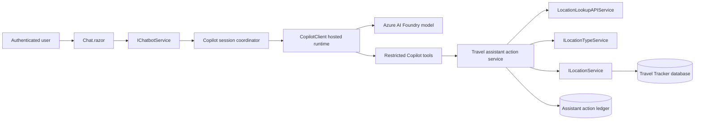

# Introduction

Convert the Travel Tracker chat provider from direct Azure OpenAI through Microsoft Agent Framework to `GitHub.Copilot.SDK` version `1.0.11`. Add a restricted set of authenticated application tools so a user can describe a visit in natural language, have the application resolve and validate the place, and safely add it to location history.

The implementation retains the current `ChatbotService` as a rollback provider until Copilot parity and action tests pass. The Copilot provider remains backed by the existing Azure AI Foundry model through managed identity.

## 1. Requirements & Constraints

### Functional Requirements

- **REQ-001**: Pin `GitHub.Copilot.SDK` to stable version `1.0.11` in `src/TravelTracker/TravelTracker.csproj`.
- **REQ-002**: Add configuration-based chat-provider selection with values `CopilotSDK` and `AgentFramework`; use `CopilotSDK` in approved environments and retain `AgentFramework` for rollback until Phase 7 completes.
- **REQ-003**: Preserve `POST /api/chatbot/message` and the `/chat` user experience while replacing the synthetic thread ID with an actual user-bound session identifier. Derive identity from the authenticated principal; a supplied query/body user ID is never authoritative.
- **REQ-004**: Support multi-turn chat for one authenticated user and thread without sharing messages, tools, or action records across users.
- **REQ-005**: Resolve named places through a candidate-based provider chain before creating a location. Return `Found`, `Ambiguous`, or `NotFound`; never silently accept the first external result.
- **REQ-006**: Validate location type through the existing location-type service; `RV Park` must resolve as a valid default type.
- **REQ-007**: Resolve supported relative-date expressions in application code using `TimeProvider`, `TimeZoneInfo`, and `DateOnly`; reject or clarify unsupported expressions and model/server date disagreement.
- **REQ-008**: Support the example request end to end, producing a persisted location with normalized address, coordinates, type, user, and visit date.
- **REQ-009**: Return structured tool/action outcomes so the assistant reports success only after a nonzero persisted location ID is returned.
- **REQ-010**: Release the first action workflow with a non-streaming response contract. Add assistant/tool streaming only after the confirmation release gate passes.
- **REQ-011**: Preserve existing read-only travel questions without injecting the user's complete location history into every prompt.

### Security Requirements

- **SEC-001**: Construct `CopilotClient` with `CopilotClientMode.Empty`; do not expose built-in shell, filesystem, code-editing, web-fetch, or arbitrary-process tools.
- **SEC-002**: Set an explicit allowlist containing only registered Travel Tracker custom tools.
- **SEC-003**: Do not include `userId`, API keys, access tokens, connection strings, or authorization decisions in model-visible tool parameters.
- **SEC-004**: Require authentication for every assistant message/action entry point. Bind user ID and thread ownership from `HttpContext.User` or Blazor `AuthenticationStateProvider`; prohibit the global API key from selecting arbitrary users on this surface.
- **SEC-005**: Use `DefaultAzureCredential` and the Foundry data-plane scope; do not add a Copilot-provider API key to source or app settings.
- **SEC-006**: Require application-level confirmation for every state-changing action in the first release. SDK permission approval may permit preparation but must never authorize a database commit.
- **SEC-007**: Reject expired, cancelled, already executed, cross-user, cross-thread, or payload-mismatched action IDs.
- **SEC-008**: Store an immutable versioned canonical command, canonical idempotency key, payload hash, and action state before a write. Execute claim, duplicate enforcement, location insert, and completion update in one SQL transaction.
- **SEC-009**: Treat tool arguments as untrusted input and enforce data annotations, field lengths, state/date/rating rules, and allowed location types outside the model.
- **SEC-010**: Disable prompt and tool-payload content capture in production telemetry by default; redact addresses and comments from routine logs.
- **SEC-011**: Reject unknown tool permission requests and log their metadata as security events.

### Reliability and Operations Requirements

- **OPS-001**: Host one `CopilotClient` per web-app instance, start it during application startup, verify it with `PingAsync`, and stop it during graceful shutdown.
- **OPS-002**: Maintain one active `CopilotSession` per user/thread, serialize turns with a per-session lock, and evict idle sessions after a configurable timeout.
- **OPS-003**: Disable SDK persistent memory and cross-session store in the first release. Delete ephemeral SDK sessions on eviction and startup cleanup. Store executable pending/committed application actions in SQL.
- **OPS-004**: Set `BaseDirectory` to an instance-local writable `COPILOT_HOME` such as `/tmp/traveltracker-copilot`. Separately validate bundled Linux `copilot-runtime`/`runtime.node` publish assets and executable permissions.
- **OPS-005**: Add health signals for runtime start/ping, Foundry authentication, model response, tool execution, action confirmation, and persistence.
- **OPS-006**: Apply cancellation and bounded timeouts to model turns, public geocoding calls, and action execution.
- **OPS-007**: Limit prompt length, turn count, tool-result size, and simultaneous sessions per user.
- **OPS-008**: Fail Copilot provider readiness when Entra authentication, SQL action storage, runtime ping, or selected Foundry configuration is unavailable.

### Constraints and Guidelines

- **CON-001**: Initial implementation targets the existing .NET 10 Blazor Server application and Azure App Service deployment.
- **CON-002**: `GitHub.Copilot.SDK` communicates with a bundled child runtime over JSON-RPC; build success alone does not validate deployment.
- **CON-003**: Existing MCP location tools are read-only and call HTTP APIs with a shared API key. They are not the initial in-app write path.
- **CON-004**: The current `LocationsController` create endpoint is commented out. Do not re-enable a generic anonymous create endpoint for the agent.
- **CON-005**: The first release supports exactly one App Service worker. Bicep and the deployment runbook must enforce capacity `1`; scale-out is blocked until session affinity or an external runtime/distributed coordinator is designed and tested.
- **GUD-001**: Keep Copilot-specific types in the web project and business action logic in `TravelTracker.Services` so domain tests do not require the SDK runtime.
- **GUD-002**: Follow current file-scoped namespace, dependency-injection, nullable-reference, and async conventions.
- **PAT-001**: Follow the golden repository's provider-selection and Foundry bearer-token pattern, adjusted to a hosted client and tool-using sessions.

### Target Architecture

### Tool Contracts

| Tool | Permission | Required model inputs | Notes |
|---|---|---|---|
| `search_user_locations` | Read, no confirmation | query | User identity is captured from the session context. Return at most 25 compact matches. |
| `get_location_types` | Read, no confirmation | none | Return valid names so the model does not invent a type. |
| `lookup_place` | Read, no confirmation | name, city, state | Optional address and ZIP. Return ranked candidate IDs and provider evidence. |
| `prepare_add_visited_location` | Prepare only | candidate ID, name, type, original date expression | Optional proposed ISO dates, address fields, coordinates, comments, rating. Never accept user ID. |

### Write Policy

`TravelAssistant:WriteMode` has one allowed first-release value: `Confirm`. The prepare tool stores a pending SQL command and returns a UI-safe summary. A provider-neutral action endpoint calls `ConfirmActionAsync` or `CancelActionAsync` with the opaque action ID and the server-derived principal.

`AutoExecute` is explicitly deferred. A later plan may add it only with a non-production deployment gate, an administrative user allowlist, and separate security approval. Ambiguous results can never be auto-executed.

### Service Lifetime Matrix

| Service | Lifetime | Rule |
|---|---|---|
| `CopilotRuntimeHostedService` / runtime accessor | Singleton | Owns one `CopilotClient`; captures no scoped services or user principal. |
| `CopilotSessionCoordinator` | Singleton | Owns sessions, immutable user/thread keys, locks, and eviction; creates scopes for tool calls. |
| `TravelAssistantToolFactory` | Singleton | Captures only `IServiceScopeFactory`, time/options, and immutable invocation context. |
| `CopilotChatbotService` / rollback `ChatbotService` | Scoped | Resolves the current authenticated user for each entry point. |
| `ITravelAssistantActionService`, repositories, `DbContext` | Scoped | Never captured by a singleton or stored in a session. |
| `ICurrentTravelUserResolver` | Scoped | Maps a trusted `ClaimsPrincipal` to one internal user asynchronously. |

Enable DI scope/build validation in tests and development startup.

### API and UI Contract

- The Blazor component obtains `ClaimsPrincipal` from `AuthenticationStateProvider` and calls the scoped service with that principal; it does not use `IHttpContextAccessor` as circuit identity.
- The HTTP message endpoint requires authorization and derives identity from `HttpContext.User`. A legacy `userId` query is ignored only when equal to the resolved user and rejected otherwise; remove it in the next API version.
- Confirmation and cancellation are provider-neutral action endpoints. They accept only an opaque action ID and use antiforgery/authorization protections.
- First-release chat remains non-streaming. JSON additions are optional `threadId`, `pendingAction`, `toolStatuses`, and `errorCode` fields. Define `401`, `403`, `404`, `409`, `410`, `429`, and `503` behavior.
- Add a query for the authenticated user's unexpired pending actions so refresh/reconnect can recover confirmation cards. Stale/unknown threads return a new thread plus an explicit `thread_replaced` status.

## 2. Implementation Steps

### Implementation Phase 1 - Secure Identity and Provider Contracts

- **GOAL-001**: Establish trusted identity, explicit provider contracts, and validated service lifetimes before adding agent behavior.

| Task | Description | Completed | Date |
|---|---|---|---|
| TASK-001 | Add `TravelAssistantOptions` with provider, model, Foundry URL, token scope, `COPILOT_HOME`, timezone, limits, and `WriteMode = Confirm`. Reject `AutoExecute`, unknown providers, missing authentication, missing SQL action storage, or incomplete selected-provider settings at startup. | ✅ | 2026-09-01 |
| TASK-002 | Add `ChatTurnResult`, `ChatActionSummary`, `ToolStatus`, and stable error-code models. Replace the tuple return in `IChatbotService` with `Task<ChatTurnResult>`; keep confirmation outside that provider interface. | ✅ | 2026-09-01 |
| TASK-003 | Add asynchronous `ICurrentTravelUserResolver`. Controllers resolve from `HttpContext.User`; Blazor resolves from `AuthenticationStateProvider`. Add `[Authorize]` to all assistant endpoints and prohibit the global API key from selecting another user on this surface. | ✅ | 2026-09-01 |
| TASK-004 | Add provider registration with the documented lifetime matrix. Select `ChatbotService` or `CopilotChatbotService`; enable `ValidateScopes` and `ValidateOnBuild` in tests and development. | ✅ | 2026-09-01 |
| TASK-005 | Update the fallback service, controller, and tests to the structured contract. Remove endpoint/exception details from user responses and reject mismatched legacy query user IDs. | ✅ | 2026-09-01 |

Completion criteria: authentication is mandatory; the global key cannot impersonate a user; scope validation passes; both providers resolve; fallback tests pass; invalid configuration fails startup without exposing secrets.

### Implementation Phase 2 - Build the Durable Action Boundary

- **GOAL-002**: Implement provider-neutral reads, deterministic interpretation, durable pending commands, and atomic confirmed writes before exposing tools.

| Task | Description | Completed | Date |
|---|---|---|---|
| TASK-006 | Add `ITravelAssistantActionService`, `TravelAssistantActionService`, and provider-neutral `ITravelAssistantActionConfirmationService`. Public methods receive trusted `TravelAssistantUserContext`; no public command accepts a model/client user ID. | ✅ | 2026-09-01 |
| TASK-007 | Add `IRelativeDateResolver` backed by `TimeProvider`, `TimeZoneInfo`, and `DateOnly`. Resolve defined relative expressions; require clarification for unsupported/ambiguous text and reject model/server disagreement. | ✅ | 2026-09-01 |
| TASK-008 | Upgrade place lookup to request multiple candidates, score normalized name/city/state, retain provider evidence, retry broader queries, detect coordinate divergence, and return `Found`, `Ambiguous`, or `NotFound`. Add a User-Agent, rate limit, cache, cancellation, and opaque 15-minute candidate IDs backed by server-owned data. | ✅ | 2026-09-01 |
| TASK-009 | Implement bounded location search, location-type resolution, and a targeted duplicate query. Exclude comments/tags from model-visible results and label stored text as untrusted. | ✅ | 2026-09-01 |
| TASK-010 | Add `AssistantAction` storage with command schema version, Data Protection encrypted canonical JSON, SHA-256 hash, unique canonical idempotency key, rowversion, sanitized summary, timestamps, error code, and created location ID. Pending payloads expire after 24 hours; clear terminal ciphertext and retain sanitized audit metadata for 90 days. | ✅ | 2026-09-01 |
| TASK-011 | Implement prepare/confirm/cancel. One serializable SQL transaction claims the pending row, uses unique idempotency and nullable unique `Location.AssistantActionId` constraints, rechecks duplicates, inserts, and records completion. Rollback leaves it pending; retry returns the prior action/result. | ✅ | 2026-09-01 |
| TASK-012 | Change location create to return or throw an explicit failure instead of ID zero. Preserve Locations-page handling and add cleanup jobs for expired actions and retained audit rows. | ✅ | 2026-09-01 |

Completion criteria: provider-free tests resolve `Yesterday` to `2026-08-31`; invalid/ambiguous inputs do not prepare writes; encrypted commands survive restart; equivalent action IDs converge; transaction-boundary failures create zero or one location; confirmations survive provider rollback.

### Implementation Phase 3 - Add SDK 1.0.11 Runtime and Sessions

- **GOAL-003**: Run one restricted Copilot runtime and bounded user-owned sessions over the proven action boundary.

| Task | Description | Completed | Date |
|---|---|---|---|
| TASK-013 | Run `dotnet add src/TravelTracker/TravelTracker.csproj package GitHub.Copilot.SDK --version 1.0.11`; retain Agent Framework packages until the post-release retirement gate. | ✅ | 2025-01-15 |
| TASK-014 | Add singleton hosted runtime/accessor using `CopilotClientMode.Empty`, writable `BaseDirectory`, content capture disabled, and Foundry `ProviderConfig` with `/openai/v1`, responses API, model, and `DefaultAzureCredential` bearer callback. | ✅ | 2025-01-15 |
| TASK-015 | Start once, `PingAsync`, expose readiness, and stop/force-stop within 10 seconds. Fail readiness if authentication, SQL action storage, runtime ping, or Foundry configuration is unavailable. | ✅ | 2025-01-15 |
| TASK-016 | Add singleton session coordinator. Map thread IDs to authenticated users, serialize with `SemaphoreSlim`, enforce 60-second turns, 15-minute idle, 3 sessions/user, 100/instance, and reject cross-user/stale use. | ✅ | 2026-09-01 |
| TASK-017 | Create non-streaming sessions with memory/store/infinite sessions disabled and explicit custom-tool allowlist. On eviction dispose then `DeleteSessionAsync`; clean abandoned state at startup and cap `COPILOT_HOME` disk use. | ✅ | 2026-09-01 |
| TASK-018 | Supply time/timezone, untrusted-data, confirmation, and success-after-persistence rules. Implement `CopilotChatbotService` with stable errors and no raw runtime exceptions. | ✅ | 2026-09-01 |

Completion criteria: restore resolves exactly `1.0.11`; Release publish contains one SDK assembly and one platform CLI asset; users/threads are isolated; turns serialize; eviction deletes SDK and bounded session state; scope validation remains green. Runtime start and ping use the real SDK APIs. A live no-tool Foundry smoke remains an environment validation requiring a configured endpoint, deployment, and managed-identity credential.

### Implementation Phase 4 - Register Restricted Travel Tracker Tools

- **GOAL-004**: Expose exactly four typed tools without granting runtime access to the host or another user.

| Task | Description | Completed | Date |
|---|---|---|---|
| TASK-019 | Define `search_user_locations`, `get_location_types`, `lookup_place`, and `prepare_add_visited_location` with `CopilotTool.DefineTool`, typed results, and one names class. | | |
| TASK-020 | Resolve a fresh DI scope per call and attach immutable coordinator-owned user/thread context. Never capture scoped EF/services in singleton/session objects. | | |
| TASK-021 | Set `SkipPermission = true` only for reads. A custom handler may approve preparation once; reject unknown requests. Preparation permission never authorizes confirmation. | | |
| TASK-022 | Add redacted pre/post/failure hooks for tool, action ID, duration, result class, and correlation ID. Never capture prompt, token, comments, address, encrypted payload, or reasoning. | | |
| TASK-023 | Add adversarial tests for host tools, secrets, injection in stored data, and other users. Assert exactly four schemas and no user/command/secret fields. | | |

Completion criteria: inventory is exactly four tools; reads are bounded; stored data cannot alter policy; prohibited requests are rejected; no model schema can select a user or commit an action.

### Implementation Phase 5 - Deliver Confirmation-Only Chat

- **GOAL-005**: Complete the non-streaming UI/API workflow, including refresh recovery and deterministic errors.

| Task | Description | Completed | Date |
|---|---|---|---|
| TASK-024 | Update `Chat.razor` and code-behind/scoped CSS to use `AuthenticationStateProvider`, render messages/tool statuses, and show pending location/source details with accessible confirmation controls. | | |
| TASK-025 | Add component confirm/cancel handlers using the provider-neutral service, disable repeats, and show executing/success/failure with created location link. | | |
| TASK-026 | Add authorized message, confirm, cancel, and pending-action endpoints. Accept action ID only for writes, derive principal server-side, enforce antiforgery, and map `401/403/404/409/410/429/503`. | | |
| TASK-027 | Recover pending actions after refresh/reconnect and return stale-thread replacement status. Remove all-data gathering/cache from the Copilot provider only. | | |
| TASK-028 | Run deterministic Buffalo House end-to-end coverage: candidate selection/clarification, `RV Park`, 2026-08-31, pending action, confirmation, and exactly one nonzero location ID. | | |

Completion criteria: the example produces clarification or a correct pending action; confirmation inserts exactly one; cancel inserts none; refresh recovers; retries do not duplicate; accessibility and authorization pass.

### Implementation Phase 6 - Deploy, Observe, and Canary

- **GOAL-006**: Prove runtime, identity, action transaction, and rollback in a one-worker pre-production environment.

| Task | Description | Completed | Date |
|---|---|---|---|
| TASK-029 | Add Bicep settings for cross-resource-group Foundry, model, scope, provider, `Confirm`, timezone, limits, `/tmp/traveltracker-copilot`, and user-assigned identity. Set `AZURE_CLIENT_ID` only for it; enforce one worker and reject scale-out. | | |
| TASK-030 | Grant only Cognitive Services OpenAI User on the actual Foundry resource group. Validate Bicep and what-if; do not grant Contributor. | | |
| TASK-031 | Add runbook/pipeline checks for Linux runtime assets/permissions, writable home, local `az login`, managed identity, schema/cleanup, readiness, and rollback. | | |
| TASK-032 | Add content-safe metrics for runtime, auth/model/tool, denied requests, pending age, transactions, duplicates, disk/RSS, and writes. | | |
| TASK-033 | Require a live `1.0.11` pre-production run with isolated data, read tool, Buffalo House confirm, cross-user denial, retry, restart recovery, and shutdown. Across 50 turns require 0 auth/duplicate defects, errors below 2%, p95 below 30 seconds, and post-eviction RSS/disk growth below 100 MB. | | |
| TASK-034 | Deploy schema with `AgentFramework`, verify provider-neutral confirmations, switch pre-production to `CopilotSDK`, pass TASK-033, then canary production with `Confirm`. | | |

Completion criteria: Bicep/what-if pass; one worker is enforced; Linux runtime and writable state work; managed identity invokes Foundry; live thresholds pass; one setting restores fallback without stranding actions.

### Implementation Phase 7 - Post-Release Enhancements and Retirement

- **GOAL-007**: Add richer UX and retire fallback only after measured stability.

| Task | Description | Completed | Date |
|---|---|---|---|
| TASK-035 | After confirmation stability, add streaming assistant/tool events without reasoning. Test cancellation, subscription disposal, disconnect, and backpressure. | | |
| TASK-036 | Observe at least 7 days and 100 production turns with 0 auth/duplicate defects, errors below 2%, and p95 below 30 seconds before making `CopilotSDK` default. | | |
| TASK-037 | Remove Azure API-key chat requirements and Agent Framework fallback/packages in a separate change after the observation gate. | | |
| TASK-038 | Create a separate security-reviewed plan for `AutoExecute`; do not enable it here. | | |

Completion criteria: streaming is independently validated; measured thresholds pass; fallback removal is separately reviewable; automatic execution stays disabled.

### Implementation Phase 8 - Reuse the Action Layer from MCP

- **GOAL-008**: Avoid business-rule divergence between in-app Copilot tools and external MCP clients.

| Task | Description | Completed | Date |
|---|---|---|---|
| TASK-039 | Refactor existing MCP read tools to delegate to the shared action/query service where practical while preserving MCP contracts. | | |
| TASK-040 | Add an MCP prepare-location tool only after MCP authentication can bind user identity without a model-supplied user ID. Keep commit/confirm unavailable until an interactive authorization contract exists. | | |
| TASK-041 | Add contract tests proving Copilot and MCP adapters return equivalent domain outcomes for lookup, type validation, duplicates, and invalid input. | | |

Completion criteria: adapters share business logic, no write rule is duplicated, and MCP cannot bypass the in-app action policy. This phase is not required to release the in-app Copilot workflow.

## 3. Alternatives

- **ALT-001**: Point Copilot SDK at the existing MCP HTTP host. Rejected for the first release because current tools are read-only, depend on a shared API key, accept model-visible user IDs, and add a network/authentication hop inside the same application.
- **ALT-002**: Re-enable the generic `LocationsController` POST endpoint and let the agent call it. Rejected because it broadens the public mutation surface and duplicates server-user binding, confirmation, and idempotency concerns.
- **ALT-003**: Give the model the complete location list in every prompt. Rejected because it increases latency, cost, privacy exposure, and staleness; targeted read tools are more accurate.
- **ALT-004**: Replace Agent Framework immediately. Rejected because provider rollback is inexpensive and protects availability while custom-tool behavior is canaried.
- **ALT-005**: Create and dispose a Copilot client per chat message, matching the golden sample. Rejected for conversational chat because it repeatedly starts the child runtime and complicates multi-turn session behavior.
- **ALT-006**: Allow automatic writes with no action ledger. Rejected because runtime/model retries could create duplicates and there would be no durable audit trail.

## 4. Dependencies

- **DEP-001**: `GitHub.Copilot.SDK` version `1.0.11`.
- **DEP-002**: Existing .NET 10 runtime and bundled SDK runtime assets.
- **DEP-003**: Existing Azure AI Foundry model with OpenAI responses-compatible endpoint.
- **DEP-004**: Existing `DefaultAzureCredential` registration and a local Azure CLI login or Azure managed identity.
- **DEP-005**: Cognitive Services OpenAI User role assignment on the Foundry resource.
- **DEP-006**: Existing SQL database, location repositories/services, location-type data, and public geocoding client.
- **DEP-007**: `TimeProvider` registration for deterministic relative-date behavior.
- **DEP-008**: Application Insights/OpenTelemetry destination for runtime and action metrics.

## 5. Files

### Files to Modify

- **FILE-001**: `src/TravelTracker/TravelTracker.csproj` - add `GitHub.Copilot.SDK` `1.0.11`.
- **FILE-002**: `src/TravelTracker/Program.cs` - options, hosted runtime, provider selection, `TimeProvider`, and action registrations.
- **FILE-003**: `src/TravelTracker/appsettings.json` - nonsecret Travel Assistant configuration placeholders.
- **FILE-004**: `src/TravelTracker.Services/Interfaces/IChatbotService.cs` - structured chat-turn method only.
- **FILE-005**: `src/TravelTracker.Services/Services/ChatbotService.cs` - rollback-provider contract and safe errors.
- **FILE-006**: `src/TravelTracker.Services/Interfaces/ILocationService.cs` and `Services/LocationService.cs` - explicit create outcome and duplicate query.
- **FILE-007**: Location repository interface/implementation - targeted duplicate lookup and explicit create outcome; the action repository owns the cross-row transaction.
- **FILE-008**: `src/TravelTracker.Data/TravelTrackerDbContext.cs` - action ledger entity mapping.
- **FILE-009**: `src/TravelTracker.Data/Models/ChatRequest.cs` - structured response/pending action contracts or replacement references.
- **FILE-010**: `src/TravelTracker/Controllers/ChatbotController.cs` - authorized result mapping; add a provider-neutral action controller for confirm/cancel/recovery.
- **FILE-011**: `src/TravelTracker/Components/Pages/Chat.razor` and scoped CSS/code-behind split required by local Blazor guidance - confirmation-first UI; streaming follows after release.
- **FILE-012**: `src/TravelTracker.Tests/Controllers/ChatbotControllerTests.cs` and service/component test files - contract, auth, tool, action, and UI coverage.
- **FILE-013**: `src/sql.database/sql.database.sqlproj` - include action ledger table script.
- **FILE-014**: `infra/Bicep/main.bicep`, `main.bicepparam`, and `modules/iam/roleassignments.bicep` - Copilot/Foundry settings and least-privilege role.
- **FILE-015**: Environment deployment workflows and setup documentation - variables, publish assets, smoke checks, and rollback.

### Files to Add

- **FILE-016**: `src/TravelTracker/AI/Configuration/TravelAssistantOptions.cs` and validator.
- **FILE-017**: `src/TravelTracker/AI/Runtime/CopilotRuntimeHostedService.cs` and runtime accessor contract.
- **FILE-018**: `src/TravelTracker/AI/Sessions/CopilotSessionCoordinator.cs` and contract.
- **FILE-019**: `src/TravelTracker/AI/Tools/TravelAssistantToolFactory.cs` and tool-name constants.
- **FILE-020**: `src/TravelTracker/AI/CopilotChatbotService.cs`.
- **FILE-021**: `src/TravelTracker/Helpers/TravelAssistantServiceCollectionExtensions.cs`.
- **FILE-022**: `src/TravelTracker.Services/Interfaces/ITravelAssistantActionService.cs`.
- **FILE-023**: `src/TravelTracker.Services/Services/TravelAssistantActionService.cs`.
- **FILE-024**: Typed chat, tool, action, and user-context models under `src/TravelTracker.Services/Models/Chat/`.
- **FILE-025**: `AssistantAction` data model/repository and `src/sql.database/Travel/Tables/AssistantActions.sql`.
- **FILE-026**: Focused tests under existing `src/TravelTracker.Tests/Services/`, `Controllers/`, and component test locations.
- **FILE-027**: Current-user resolver, provider-neutral confirmation contract, deterministic date resolver, and implementations.
- **FILE-028**: Publish/pre-production validation script for fixed `1.0.11`, runtime assets, live tools, restart recovery, and release thresholds.

## 6. Testing

- **TEST-001**: Package assertion verifies resolved `GitHub.Copilot.SDK` version is exactly `1.0.11` and no preview version is present.
- **TEST-002**: Provider-registration tests cover Copilot, Agent Framework, unknown provider, and missing selected-provider settings.
- **TEST-003**: Runtime lifecycle tests cover start, ping, readiness failure, cancellation, graceful stop, forced stop, and missing runtime assets.
- **TEST-004**: Session tests cover user/thread ownership, concurrent turns, idle eviction, limits, cancellation, disposal, `DeleteSessionAsync`, startup cleanup, and disk cap.
- **TEST-005**: Tool inventory test asserts exactly four allowed Travel Tracker tools and no built-in shell/filesystem/web tools.
- **TEST-006**: Tool schema tests assert no `userId`, token, key, connection string, or arbitrary command/URL input exists.
- **TEST-007**: Server date-resolver tests freeze time at 2026-09-01 in `America/Chicago` and assert `Yesterday` becomes 2026-08-31; cover midnight, DST, unsupported text, and model/server disagreement.
- **TEST-008**: Lookup tests cover multiple/ranked candidates, broader-query fallback, no/ambiguous match, provider divergence, expiry/tampering, rate limit, cache, timeout, state normalization, and the exact Buffalo House phrase.
- **TEST-009**: Location-type tests cover exact `RV Park`, case-insensitive match, unknown type, and multiple possible types.
- **TEST-010**: Action tests cover encrypted canonical payload round-trip/restart, hash verification, unique idempotency, validation, pending/confirm/cancel/expiry, cross-user/thread rejection, tampering, equivalent action IDs, retry, transaction-boundary failure, and concurrent confirmation.
- **TEST-011**: Persistence tests prove success requires a nonzero location ID and failures never produce an assistant success result.
- **TEST-012**: Security tests prompt for shell execution, file reads, secret disclosure, arbitrary HTTP, SQL, and another user's location; every attempt must be denied or unavailable.
- **TEST-013**: Controller and Blazor tests prove all assistant identity is principal-derived, the global API key cannot impersonate, antiforgery is enforced, and forged query/body user IDs cannot read, prepare, confirm, or cancel.
- **TEST-014**: Component tests cover keyboard send, loading state, tool status, pending action details, confirm/cancel, repeat-click prevention, error state, and accessible labels/focus.
- **TEST-015**: End-to-end test uses deterministic fake model/tool planning and fake geocoding to submit the Buffalo House prompt, confirm, and verify one persisted 2026-08-31 RV Park location.
- **TEST-016**: Mandatory pre-production `1.0.11` integration verifies Foundry identity/model, custom read tool, confirmed Buffalo House write, cross-user denial, retry, restart recovery, and the Phase 6 numeric thresholds.
- **TEST-017**: Publish/deployment smoke verifies bundled runtime assets, writable base directory, runtime ping, Foundry token acquisition, health endpoint, and clean shutdown on Linux App Service.
- **TEST-018**: Regression suite runs `dotnet test src/TravelTracker.sln` and validates existing Locations, authentication, API, MCP read, and chatbot behavior.
- **TEST-019**: Bicep lint/build and Azure what-if verify settings and least-privilege role assignment before deployment.
- **TEST-020**: Load test verifies 3 sessions/user and 100/instance limits, per-session serialization, `429` behavior, idle deletion, and post-eviction RSS/disk growth below 100 MB from baseline.

## 7. Risks & Assumptions

- **RISK-001**: The bundled child runtime may have App Service filesystem/process constraints. Mitigation: publish-asset assertion, writable base directory, startup ping, Linux deployment smoke, and provider rollback.
- **RISK-002**: SDK API behavior may change after `1.0.11`. Mitigation: exact pin, lock-file/assets assertion, isolated adapter, and planned upgrade testing.
- **RISK-003**: Foundry bearer-token behavior conflicts with older BYOK wording in root documentation. Mitigation: compile and live smoke the exact provider callback before removing current credentials or fallback.
- **RISK-004**: Public geocoding may miss or select the wrong park. Mitigation: multiple candidates, broader-query fallback, provider evidence/divergence, explicit clarification, configured User-Agent/rate limit/cache, and confirmation-only release.
- **RISK-005**: Prompt injection attempts to access built-in runtime tools. Mitigation: empty client mode, explicit tool allowlist, custom permission rejection, and adversarial tests.
- **RISK-006**: Session objects capture scoped dependencies or user context. Mitigation: immutable session identity plus a new DI scope per tool invocation.
- **RISK-007**: Repeated model/tool/browser calls create duplicate locations. Mitigation: encrypted canonical command, unique idempotency/action constraints, serializable transaction, duplicate query, and crash/concurrency tests.
- **RISK-008**: Server-local session ownership fails under scale-out. Mitigation: one-instance constraint for first release; require affinity or external runtime/distributed coordinator before scaling out.
- **RISK-009**: Post-release streaming subscriptions may leak across Blazor circuit disposal. Mitigation: streaming is outside the first release and requires cancellation, disposal, disconnect, and backpressure tests.
- **RISK-010**: Existing create service suppresses exceptions. Mitigation: explicit action/create result and regression tests before tools can write.
- **ASSUMPTION-001**: The selected Foundry deployment supports the OpenAI responses wire API required by the provider configuration.
- **ASSUMPTION-002**: The app's user-assigned managed identity can be assigned Cognitive Services OpenAI User on the cross-resource-group Foundry resource.
- **ASSUMPTION-003**: `RV Park` remains seeded in the location-type table.
- **ASSUMPTION-004**: Initial production deployment can run as one App Service instance.
- **ASSUMPTION-005**: `America/Chicago` is an acceptable initial default timezone; per-user timezone settings can replace it later.

### Rollback Criteria

Set `TravelAssistant__Provider=AgentFramework` and restart if readiness fails, model/tool error rate reaches 2% over the latest 50 turns, p95 completed-turn latency exceeds 30 seconds, runtime RSS/disk remains more than 100 MB above baseline after eviction, or any authorization/duplicate defect occurs. `WriteMode` remains `Confirm`. Do not roll back the additive action schema or provider-neutral confirmation service; pending actions must remain confirmable during provider rollback.

## 8. Related Specifications / Further Reading

- [Research findings](research-findings.md)
- [Folder overview](README.md)
- [Rubber-duck review](rubber-duck-review.md)
- `https://github.com/github/copilot-sdk`
- `https://github.com/github/copilot-sdk/blob/main/dotnet/README.md`
- `https://github.com/github/copilot-sdk/blob/main/docs/setup/azure-managed-identity.md`
- Earlier Copilot SDK sample implementation reviewed during research (see [Research findings](research-findings.md))
- `https://github.com/lluppesms/simple.ghcp.sdk.byok`