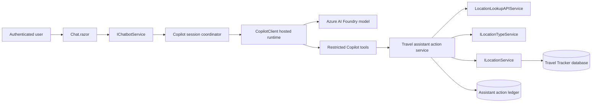

# Introduction

Convert the Travel Tracker chat provider from direct Azure OpenAI through Microsoft Agent Framework to `GitHub.Copilot.SDK` version `1.0.11`. Add a restricted set of authenticated application tools so a user can describe a visit in natural language, have the application resolve and validate the place, and safely add it to location history.

The implementation retains the current `ChatbotService` as a rollback provider until Copilot parity and action tests pass. The Copilot provider remains backed by the existing Azure AI Foundry model through managed identity.

## 1. Requirements & Constraints

### Functional Requirements

- **REQ-001**: Pin `GitHub.Copilot.SDK` to stable version `1.0.11` in `src/TravelTracker/TravelTracker.csproj`.
- **REQ-002**: Add configuration-based chat-provider selection with values `CopilotSDK` and `AgentFramework`; use `CopilotSDK` in approved environments and retain `AgentFramework` for rollback until Phase 7 completes.
- **REQ-003**: Preserve `POST /api/chatbot/message` and the `/chat` user experience while replacing the synthetic thread ID with an actual user-bound session identifier.
- **REQ-004**: Support multi-turn chat for one authenticated user and thread without sharing messages, tools, or action records across users.
- **REQ-005**: Resolve named places through the existing public lookup implementation before creating a location.
- **REQ-006**: Validate location type through the existing location-type service; `RV Park` must resolve as a valid default type.
- **REQ-007**: Convert relative dates against an application-supplied local date and configured timezone, then pass ISO dates to application tools.
- **REQ-008**: Support the example request end to end, producing a persisted location with normalized address, coordinates, type, user, and visit date.
- **REQ-009**: Return structured tool/action outcomes so the assistant reports success only after a nonzero persisted location ID is returned.
- **REQ-010**: Stream assistant text and tool-status events to the UI after the initial non-streaming path is stable.
- **REQ-011**: Preserve existing read-only travel questions without injecting the user's complete location history into every prompt.

### Security Requirements

- **SEC-001**: Construct `CopilotClient` with `CopilotClientMode.Empty`; do not expose built-in shell, filesystem, code-editing, web-fetch, or arbitrary-process tools.
- **SEC-002**: Set an explicit allowlist containing only registered Travel Tracker custom tools.
- **SEC-003**: Do not include `userId`, API keys, access tokens, connection strings, or authorization decisions in model-visible tool parameters.
- **SEC-004**: Bind the authenticated user ID and thread ownership in server code before every tool execution and confirmation.
- **SEC-005**: Use `DefaultAzureCredential` and the Foundry data-plane scope; do not add a Copilot-provider API key to source or app settings.
- **SEC-006**: Require application-level confirmation for state-changing actions by default. SDK `PermissionHandler.ApproveAll` must not authorize database writes.
- **SEC-007**: Reject expired, cancelled, already executed, cross-user, cross-thread, or payload-mismatched action IDs.
- **SEC-008**: Store an idempotency key and action state before a write; execute a confirmed action at most once.
- **SEC-009**: Treat tool arguments as untrusted input and enforce data annotations, field lengths, state/date/rating rules, and allowed location types outside the model.
- **SEC-010**: Disable prompt and tool-payload content capture in production telemetry by default; redact addresses and comments from routine logs.
- **SEC-011**: Reject unknown tool permission requests and log their metadata as security events.

### Reliability and Operations Requirements

- **OPS-001**: Host one `CopilotClient` per web-app instance, start it during application startup, verify it with `PingAsync`, and stop it during graceful shutdown.
- **OPS-002**: Maintain one active `CopilotSession` per user/thread, serialize turns with a per-session lock, and evict idle sessions after a configurable timeout.
- **OPS-003**: Disable SDK persistent memory and cross-session store in the first release. Store pending/committed application actions in SQL.
- **OPS-004**: Set a writable `BaseDirectory` for the bundled runtime in App Service and validate the bundled `copilot-runtime` and `runtime.node` files in publish output.
- **OPS-005**: Add health signals for runtime start/ping, Foundry authentication, model response, tool execution, action confirmation, and persistence.
- **OPS-006**: Apply cancellation and bounded timeouts to model turns, public geocoding calls, and action execution.
- **OPS-007**: Limit prompt length, turn count, tool-result size, and simultaneous sessions per user.

### Constraints and Guidelines

- **CON-001**: Initial implementation targets the existing .NET 10 Blazor Server application and Azure App Service deployment.
- **CON-002**: `GitHub.Copilot.SDK` communicates with a bundled child runtime over JSON-RPC; build success alone does not validate deployment.
- **CON-003**: Existing MCP location tools are read-only and call HTTP APIs with a shared API key. They are not the initial in-app write path.
- **CON-004**: The current `LocationsController` create endpoint is commented out. Do not re-enable a generic anonymous create endpoint for the agent.
- **CON-005**: The first release supports one app instance. Scale-out is blocked until session affinity or an external runtime/distributed coordinator is designed and tested.
- **GUD-001**: Keep Copilot-specific types in the web project and business action logic in `TravelTracker.Services` so domain tests do not require the SDK runtime.
- **GUD-002**: Follow current file-scoped namespace, dependency-injection, nullable-reference, and async conventions.
- **PAT-001**: Follow the golden repository's provider-selection and Foundry bearer-token pattern, adjusted to a hosted client and tool-using sessions.

### Target Architecture

### Tool Contracts

| Tool | Permission | Required model inputs | Notes |
|---|---|---|---|
| `search_user_locations` | Read, no confirmation | query | User identity is captured from the session context. Return at most 25 compact matches. |
| `get_location_types` | Read, no confirmation | none | Return valid names so the model does not invent a type. |
| `lookup_place` | Read, no confirmation | name, city, state | Optional address and ZIP. Return source and ambiguity/confidence fields. |
| `prepare_add_visited_location` | Application policy | name, type, ISO start date | Optional end date, address fields, coordinates, comments, rating. Never accept user ID. |

### Write Policy

`TravelAssistant:WriteMode` has two allowed values:

- `Confirm` is the default. The prepare tool creates a pending SQL action and returns a UI-safe summary. The UI calls `ConfirmActionAsync` or `CancelActionAsync` with the opaque action ID.
- `AutoExecute` is allowed only for a single-user/personal environment after all Phase 5 security and idempotency tests pass. The same action service records and executes the action immediately. Ambiguous lookup results always fall back to confirmation.

## 2. Implementation Steps

### Implementation Phase 1 - Establish Provider Boundary and Contracts

- **GOAL-001**: Preserve existing behavior behind explicit provider and response contracts before introducing the Copilot runtime.

| Task | Description | Completed | Date |
|---|---|---|---|
| TASK-001 | Add `TravelAssistantOptions` under `src/TravelTracker/AI/Configuration/` with provider, model, Foundry URL, token scope, runtime base directory, session timeout, timezone, limits, and write mode. Add startup validation for selected provider settings. | | |
| TASK-002 | Add `ChatTurnResult`, `ChatActionSummary`, and `ChatStreamEvent` under `src/TravelTracker.Services/Models/Chat/`. Replace the tuple return in `IChatbotService` with `Task<ChatTurnResult>` and add confirm/cancel methods. | | |
| TASK-003 | Update the existing `ChatbotService` to return `ChatTurnResult` without changing Agent Framework behavior. Remove error details and endpoint values from user-visible responses while retaining structured logs. | | |
| TASK-004 | Add `AddTravelAssistant` registration in `src/TravelTracker/Helpers/` and update `Program.cs` to select `ChatbotService` for `AgentFramework` or `CopilotChatbotService` for `CopilotSDK`. Reject unknown provider values at startup. | | |
| TASK-005 | Update controller and component tests for the new result contract before adding SDK behavior. | | |

Completion criteria: both provider values resolve the expected `IChatbotService`; Agent Framework chat tests pass unchanged at the behavioral level; invalid configuration fails startup with no secrets in the error.

### Implementation Phase 2 - Add and Host GitHub Copilot SDK 1.0.11

- **GOAL-002**: Run one restricted, observable Copilot runtime per app instance with managed-identity Foundry access.

| Task | Description | Completed | Date |
|---|---|---|---|
| TASK-006 | Run `dotnet add src/TravelTracker/TravelTracker.csproj package GitHub.Copilot.SDK --version 1.0.11`; retain Agent Framework packages until rollback retirement. | | |
| TASK-007 | Add `CopilotRuntimeHostedService` as a singleton `IHostedService` and `IAsyncDisposable`. Construct `CopilotClientOptions` with `Mode = CopilotClientMode.Empty`, writable `BaseDirectory`, SDK logger, content-safe telemetry, and no ambient GitHub user requirement for the Foundry provider. | | |
| TASK-008 | Start the client once, call `PingAsync`, expose readiness, and stop/force-stop with bounded shutdown handling. Register the hosted instance as the runtime accessor used by session coordination. | | |
| TASK-009 | Configure `ProviderConfig` with type `openai`, `${FoundryResourceUrl}/openai/v1`, responses wire API, model deployment, and a bearer-token callback using the existing singleton `DefaultAzureCredential`. | | |
| TASK-010 | Add a runtime smoke test command that starts the published application, verifies readiness, sends a no-tool prompt, and confirms clean shutdown. Keep the live Foundry test opt-in through environment configuration. | | |

Completion criteria: package restore pins `1.0.11`; publish output contains the runtime wrapper pair; local startup pings the runtime; a configured identity receives a nonempty Foundry response; an unconfigured provider fails safely.

### Implementation Phase 3 - Build User-Isolated Session Coordination

- **GOAL-003**: Replace synthetic threads with bounded, concurrent, user-owned Copilot sessions.

| Task | Description | Completed | Date |
|---|---|---|---|
| TASK-011 | Add `ICopilotSessionCoordinator` and `CopilotSessionCoordinator` under `src/TravelTracker/AI/Sessions/`. Key sessions by an opaque thread ID mapped to authenticated user ID; never derive authorization from the client thread ID alone. | | |
| TASK-012 | Create sessions with `InfiniteSessions.Enabled = false`, memory disabled, cross-session store disabled, streaming initially false, explicit system message append mode, explicit custom tools, and explicit allowed-tool names. | | |
| TASK-013 | Add a `SemaphoreSlim` per session to serialize turns; enforce turn timeout, idle eviction, maximum active sessions per user, cancellation, and deterministic disposal. | | |
| TASK-014 | Supply current UTC time, configured local date/timezone, authenticated-user context statement, tool-use rules, confirmation policy, and success-reporting rules in the session system instructions. Do not inject the complete location collection. | | |
| TASK-015 | Implement `CopilotChatbotService` using the coordinator and map assistant, error, and tool events into `ChatTurnResult`. Do not return raw runtime exceptions to the browser. | | |

Completion criteria: two threads for one user remain independent; two users cannot use each other's thread IDs; simultaneous turns in one thread are serialized; idle sessions are disposed; relative-date tests use a fake `TimeProvider`.

### Implementation Phase 4 - Implement SDK-Independent Travel Actions

- **GOAL-004**: Create one authoritative, testable business layer for agent reads, place resolution, draft validation, and exactly-once writes.

| Task | Description | Completed | Date |
|---|---|---|---|
| TASK-016 | Add `ITravelAssistantActionService` and `TravelAssistantActionService` in `TravelTracker.Services`. Its public inputs exclude user ID; methods receive an internal `TravelAssistantUserContext` created by authenticated server code. | | |
| TASK-017 | Implement location search using scoped `ILocationService`, capped and projected to fields needed by the agent. Add repository/service duplicate lookup by normalized name, city, state, and visit date instead of loading all locations for a write check. | | |
| TASK-018 | Implement place resolution through `LocationLookupAPIService`; return explicit `Found`, `NotFound`, or `Ambiguous` outcomes. Preserve provider source and normalized fields. Do not automatically execute ambiguous results. | | |
| TASK-019 | Implement location-type resolution through `ILocationTypeService`, exact match first and case-insensitive unique match second. Return valid choices for unknown types. | | |
| TASK-020 | Add an `AssistantAction` model, repository, SQL table, and status enum for `Pending`, `Executing`, `Executed`, `Failed`, `Cancelled`, and `Expired`. Store opaque action ID, user ID, thread ID, tool name, payload hash, sanitized summary, timestamps, and created location ID. | | |
| TASK-021 | Implement `PrepareAddVisitedLocationAsync` with data validation, lookup reconciliation, duplicate check, payload hash, expiration, and write policy. Implement transactional compare-and-set execution so repeated confirmation returns the first result and never inserts twice. | | |
| TASK-022 | Change the location create boundary to return or throw an explicit failure instead of representing failure as `new Location()` with ID zero. Preserve user-friendly handling in the Locations page. | | |

Completion criteria: domain tests run without the Copilot runtime; invalid and ambiguous inputs do not write; duplicate or repeated actions do not create a second row; every attempted action has a terminal or pending audit state.

### Implementation Phase 5 - Register Restricted Copilot Tools

- **GOAL-005**: Let the model orchestrate only approved Travel Tracker capabilities.

| Task | Description | Completed | Date |
|---|---|---|---|
| TASK-023 | Add `TravelAssistantToolFactory` under `src/TravelTracker/AI/Tools/`. Define all tools with `CopilotTool.DefineTool`, descriptive parameters, typed JSON-serializable results, cancellation, and names from one constants class. | | |
| TASK-024 | Resolve a fresh dependency-injection scope per tool call through `IServiceScopeFactory`; attach the immutable user/thread context owned by the session coordinator. Never capture a request-scoped service in a singleton session. | | |
| TASK-025 | Mark only the three read tools with `SkipPermission = true`. Route `prepare_add_visited_location` through application write policy and a custom permission handler; reject every unknown permission/tool request. | | |
| TASK-026 | Add pre/post/failure hooks that record tool name, action ID, duration, success class, and correlation ID without recording tokens, complete prompts, comments, or full addresses. | | |
| TASK-027 | Add prompt-injection defenses to the system instructions and enforce them technically with empty client mode and the explicit allowlist. Test requests for shell, files, arbitrary URLs, secrets, SQL, and another user's records. | | |

Completion criteria: runtime tool inventory contains only the four named tools; read tools return bounded results; prohibited tool attempts are rejected; a forged user ID cannot be supplied because no tool schema contains it.

### Implementation Phase 6 - Complete Chat UI, API, and Confirmation Flow

- **GOAL-006**: Provide a clear user workflow for tool progress, proposed writes, confirmation, cancellation, and completion.

| Task | Description | Completed | Date |
|---|---|---|---|
| TASK-028 | Update `Chat.razor` to render assistant/user messages, tool-status rows, and a pending location action with normalized place, type, visit dates, and source. Use icon buttons with accessible labels for confirm/cancel and preserve keyboard submission/focus. | | |
| TASK-029 | Add `ConfirmActionAsync` and `CancelActionAsync` handlers to the component. Disable repeat clicks, show executing/success/failure states, and refresh or link to the Locations view after success. | | |
| TASK-030 | Add authenticated controller endpoints for confirm/cancel using action ID only. Resolve current user server-side; do not accept user ID in the body. Keep message endpoint compatibility while deprecating query-string user ID after callers migrate. | | |
| TASK-031 | Enable SDK streaming and map `AssistantMessageDeltaEvent`, tool start/complete/failure, final message, idle, and error events to the Blazor UI without exposing model reasoning events. | | |
| TASK-032 | Remove the obsolete all-data prompt gathering and mutable previous-context cache from the Copilot path. Retain them only inside the rollback provider until retirement. | | |

Completion criteria: the example prompt creates a correct pending action and confirmation inserts one location; auto mode inserts one location without a second prompt; cancel writes nothing; refresh/retry cannot duplicate; all controls pass keyboard and accessible-name checks.

### Implementation Phase 7 - Infrastructure, Observability, and Rollout

- **GOAL-007**: Deploy the bundled runtime and Foundry identity configuration safely, canary the provider, and define rollback.

| Task | Description | Completed | Date |
|---|---|---|---|
| TASK-033 | Add Bicep parameters for Foundry resource name/resource group, Copilot model, token scope, runtime base directory, provider, write mode, timezone, limits, and session timeout. Map them to `TravelAssistant__*`, `AZURE_TOKEN_CREDENTIALS`, and `AZURE_CLIENT_ID` app settings. | | |
| TASK-034 | Pass the Foundry account into `infra/Bicep/modules/iam/roleassignments.bicep` and grant the app's user-assigned identity the least-privilege Cognitive Services OpenAI User data-plane role. Do not grant Contributor for inference. | | |
| TASK-035 | Update deployment pipelines and documentation with nonsecret variables, local `az login` prerequisites, managed-identity troubleshooting, writable runtime path, and provider rollback setting. | | |
| TASK-036 | Add dashboards/alerts for runtime readiness, model latency/error class, token acquisition failure, tool latency/failure, denied tool requests, pending-action age, confirmation rate, duplicate prevention, and location write outcomes. | | |
| TASK-037 | Deploy with `AgentFramework`, validate schema and runtime health, switch one development environment to `CopilotSDK` plus `Confirm`, run the acceptance suite, then promote by environment. | | |
| TASK-038 | After an agreed observation period with no critical failures, make `CopilotSDK` the default, remove the Azure API-key requirement for chat, and separately schedule removal of Agent Framework packages and fallback code. | | |

Completion criteria: Bicep validation and what-if pass; App Service starts the bundled runtime from a writable location; managed identity invokes Foundry; canary acceptance passes; changing one provider setting rolls chat back without a database rollback.

### Implementation Phase 8 - Reuse the Action Layer from MCP

- **GOAL-008**: Avoid business-rule divergence between in-app Copilot tools and external MCP clients.

| Task | Description | Completed | Date |
|---|---|---|---|
| TASK-039 | Refactor existing MCP read tools to delegate to the shared action/query service where practical while preserving MCP contracts. | | |
| TASK-040 | Add an MCP prepare-location tool only after MCP authentication can bind user identity without a model-supplied user ID. Keep commit/confirm unavailable until an interactive authorization contract exists. | | |
| TASK-041 | Add contract tests proving Copilot and MCP adapters return equivalent domain outcomes for lookup, type validation, duplicates, and invalid input. | | |

Completion criteria: adapters share business logic, no write rule is duplicated, and MCP cannot bypass the in-app action policy. This phase is not required to release the in-app Copilot workflow.

## 3. Alternatives

- **ALT-001**: Point Copilot SDK at the existing MCP HTTP host. Rejected for the first release because current tools are read-only, depend on a shared API key, accept model-visible user IDs, and add a network/authentication hop inside the same application.
- **ALT-002**: Re-enable the generic `LocationsController` POST endpoint and let the agent call it. Rejected because it broadens the public mutation surface and duplicates server-user binding, confirmation, and idempotency concerns.
- **ALT-003**: Give the model the complete location list in every prompt. Rejected because it increases latency, cost, privacy exposure, and staleness; targeted read tools are more accurate.
- **ALT-004**: Replace Agent Framework immediately. Rejected because provider rollback is inexpensive and protects availability while custom-tool behavior is canaried.
- **ALT-005**: Create and dispose a Copilot client per chat message, matching the golden sample. Rejected for conversational chat because it repeatedly starts the child runtime and complicates multi-turn session behavior.
- **ALT-006**: Allow automatic writes with no action ledger. Rejected because runtime/model retries could create duplicates and there would be no durable audit trail.

## 4. Dependencies

- **DEP-001**: `GitHub.Copilot.SDK` version `1.0.11`.
- **DEP-002**: Existing .NET 10 runtime and bundled SDK runtime assets.
- **DEP-003**: Existing Azure AI Foundry model with OpenAI responses-compatible endpoint.
- **DEP-004**: Existing `DefaultAzureCredential` registration and a local Azure CLI login or Azure managed identity.
- **DEP-005**: Cognitive Services OpenAI User role assignment on the Foundry resource.
- **DEP-006**: Existing SQL database, location repositories/services, location-type data, and public geocoding client.
- **DEP-007**: `TimeProvider` registration for deterministic relative-date behavior.
- **DEP-008**: Application Insights/OpenTelemetry destination for runtime and action metrics.

## 5. Files

### Files to Modify

- **FILE-001**: `src/TravelTracker/TravelTracker.csproj` - add `GitHub.Copilot.SDK` `1.0.11`.
- **FILE-002**: `src/TravelTracker/Program.cs` - options, hosted runtime, provider selection, `TimeProvider`, and action registrations.
- **FILE-003**: `src/TravelTracker/appsettings.json` - nonsecret Travel Assistant configuration placeholders.
- **FILE-004**: `src/TravelTracker.Services/Interfaces/IChatbotService.cs` - structured turn and action methods.
- **FILE-005**: `src/TravelTracker.Services/Services/ChatbotService.cs` - rollback-provider contract and safe errors.
- **FILE-006**: `src/TravelTracker.Services/Interfaces/ILocationService.cs` and `Services/LocationService.cs` - explicit create outcome and duplicate query.
- **FILE-007**: Location repository interface/implementation - targeted duplicate lookup and action transaction support.
- **FILE-008**: `src/TravelTracker.Data/TravelTrackerDbContext.cs` - action ledger entity mapping.
- **FILE-009**: `src/TravelTracker.Data/Models/ChatRequest.cs` - structured response/pending action contracts or replacement references.
- **FILE-010**: `src/TravelTracker/Controllers/ChatbotController.cs` - result mapping and authenticated confirm/cancel endpoints.
- **FILE-011**: `src/TravelTracker/Components/Pages/Chat.razor` and scoped CSS/code-behind split required by local Blazor guidance - action and streaming UI.
- **FILE-012**: `src/TravelTracker.Tests/Controllers/ChatbotControllerTests.cs` and service/component test files - contract, auth, tool, action, and UI coverage.
- **FILE-013**: `src/sql.database/sql.database.sqlproj` - include action ledger table script.
- **FILE-014**: `infra/Bicep/main.bicep`, `main.bicepparam`, and `modules/iam/roleassignments.bicep` - Copilot/Foundry settings and least-privilege role.
- **FILE-015**: Environment deployment workflows and setup documentation - variables, publish assets, smoke checks, and rollback.

### Files to Add

- **FILE-016**: `src/TravelTracker/AI/Configuration/TravelAssistantOptions.cs` and validator.
- **FILE-017**: `src/TravelTracker/AI/Runtime/CopilotRuntimeHostedService.cs` and runtime accessor contract.
- **FILE-018**: `src/TravelTracker/AI/Sessions/CopilotSessionCoordinator.cs` and contract.
- **FILE-019**: `src/TravelTracker/AI/Tools/TravelAssistantToolFactory.cs` and tool-name constants.
- **FILE-020**: `src/TravelTracker/AI/CopilotChatbotService.cs`.
- **FILE-021**: `src/TravelTracker/Helpers/TravelAssistantServiceCollectionExtensions.cs`.
- **FILE-022**: `src/TravelTracker.Services/Interfaces/ITravelAssistantActionService.cs`.
- **FILE-023**: `src/TravelTracker.Services/Services/TravelAssistantActionService.cs`.
- **FILE-024**: Typed chat, tool, action, and user-context models under `src/TravelTracker.Services/Models/Chat/`.
- **FILE-025**: `AssistantAction` data model/repository and `src/sql.database/Travel/Tables/AssistantActions.sql`.
- **FILE-026**: Focused tests under existing `src/TravelTracker.Tests/Services/`, `Controllers/`, and component test locations.

## 6. Testing

- **TEST-001**: Package assertion verifies resolved `GitHub.Copilot.SDK` version is exactly `1.0.11` and no preview version is present.
- **TEST-002**: Provider-registration tests cover Copilot, Agent Framework, unknown provider, and missing selected-provider settings.
- **TEST-003**: Runtime lifecycle tests cover start, ping, readiness failure, cancellation, graceful stop, forced stop, and missing runtime assets.
- **TEST-004**: Session tests cover user/thread ownership, concurrent turns, idle eviction, session limit, cancellation, and disposal.
- **TEST-005**: Tool inventory test asserts exactly four allowed Travel Tracker tools and no built-in shell/filesystem/web tools.
- **TEST-006**: Tool schema tests assert no `userId`, token, key, connection string, or arbitrary command/URL input exists.
- **TEST-007**: Relative-date tests freeze time at 2026-09-01 in `America/Chicago` and assert `Yesterday` becomes 2026-08-31, including DST boundary cases.
- **TEST-008**: Lookup tests cover exact match, no match, ambiguous match, geocoder failure/timeout, state normalization, and coordinate fallback.
- **TEST-009**: Location-type tests cover exact `RV Park`, case-insensitive match, unknown type, and multiple possible types.
- **TEST-010**: Action tests cover validation, pending state, confirm, cancel, expiry, cross-user/cross-thread rejection, payload tampering, duplicate visit, retry, and concurrent double confirmation.
- **TEST-011**: Persistence tests prove success requires a nonzero location ID and failures never produce an assistant success result.
- **TEST-012**: Security tests prompt for shell execution, file reads, secret disclosure, arbitrary HTTP, SQL, and another user's location; every attempt must be denied or unavailable.
- **TEST-013**: Controller tests prove user identity is server-derived for confirm/cancel and forged query/body user IDs cannot authorize an action.
- **TEST-014**: Component tests cover keyboard send, loading state, tool status, pending action details, confirm/cancel, repeat-click prevention, error state, and accessible labels/focus.
- **TEST-015**: End-to-end test uses deterministic fake model/tool planning and fake geocoding to submit the Buffalo House prompt, confirm, and verify one persisted 2026-08-31 RV Park location.
- **TEST-016**: Optional live integration smoke uses configured Foundry identity/model to verify a custom read tool call and one confirmed write in an isolated test user/database.
- **TEST-017**: Publish/deployment smoke verifies bundled runtime assets, writable base directory, runtime ping, Foundry token acquisition, health endpoint, and clean shutdown on Linux App Service.
- **TEST-018**: Regression suite runs `dotnet test src/TravelTracker.sln` and validates existing Locations, authentication, API, MCP read, and chatbot behavior.
- **TEST-019**: Bicep lint/build and Azure what-if verify settings and least-privilege role assignment before deployment.
- **TEST-020**: Load test verifies configured concurrent sessions, per-session serialization, idle eviction, and bounded memory/process growth.

## 7. Risks & Assumptions

- **RISK-001**: The bundled child runtime may have App Service filesystem/process constraints. Mitigation: publish-asset assertion, writable base directory, startup ping, Linux deployment smoke, and provider rollback.
- **RISK-002**: SDK API behavior may change after `1.0.11`. Mitigation: exact pin, lock-file/assets assertion, isolated adapter, and planned upgrade testing.
- **RISK-003**: Foundry bearer-token behavior conflicts with older BYOK wording in root documentation. Mitigation: compile and live smoke the exact provider callback before removing current credentials or fallback.
- **RISK-004**: Public geocoding may select the wrong park. Mitigation: ambiguity status, source display, confirmation by default, and no auto-execution below confidence policy.
- **RISK-005**: Prompt injection attempts to access built-in runtime tools. Mitigation: empty client mode, explicit tool allowlist, custom permission rejection, and adversarial tests.
- **RISK-006**: Session objects capture scoped dependencies or user context. Mitigation: immutable session identity plus a new DI scope per tool invocation.
- **RISK-007**: Repeated model/tool/browser calls create duplicate locations. Mitigation: durable action ledger, payload hash, duplicate query, transactional state transition, and concurrency tests.
- **RISK-008**: Server-local session ownership fails under scale-out. Mitigation: one-instance constraint for first release; require affinity or external runtime/distributed coordinator before scaling out.
- **RISK-009**: Streaming event subscriptions leak across Blazor circuit disposal. Mitigation: disposable subscriptions, cancellation, component disposal, and disconnect tests.
- **RISK-010**: Existing create service suppresses exceptions. Mitigation: explicit action/create result and regression tests before tools can write.
- **ASSUMPTION-001**: The selected Foundry deployment supports the OpenAI responses wire API required by the provider configuration.
- **ASSUMPTION-002**: The app's managed identity can be assigned Cognitive Services OpenAI User on the Foundry resource.
- **ASSUMPTION-003**: `RV Park` remains seeded in the location-type table.
- **ASSUMPTION-004**: Initial production deployment can run as one App Service instance.
- **ASSUMPTION-005**: `America/Chicago` is an acceptable initial default timezone; per-user timezone settings can replace it later.

### Rollback Criteria

Set `TravelAssistant__Provider=AgentFramework` and restart the app if runtime readiness fails, Foundry authentication/model errors exceed the agreed threshold, tool authorization isolation fails, duplicate writes occur, or p95 chat latency exceeds the release budget. Do not roll back the action ledger schema; it is additive and supports audit/diagnosis. Disable `AutoExecute` independently by setting `TravelAssistant__WriteMode=Confirm`.

## 8. Related Specifications / Further Reading

- [Research findings](research-findings.md)
- [Folder overview](README.md)
- `https://github.com/github/copilot-sdk`
- `https://github.com/github/copilot-sdk/blob/main/dotnet/README.md`
- `https://github.com/github/copilot-sdk/blob/main/docs/setup/azure-managed-identity.md`
- `https://github.com/lluppesms/dadabase.demo/tree/main/Docs/Updates/Refactor-AI-Calls`
- `https://github.com/lluppesms/simple.ghcp.sdk.byok`