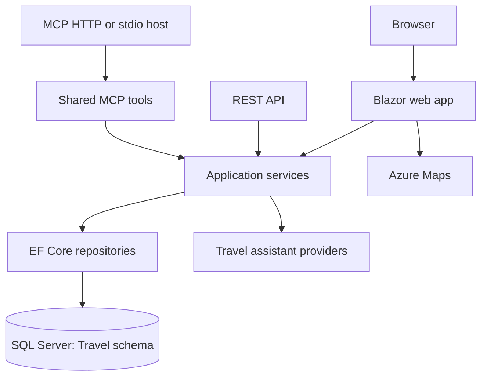

# Travel Tracker

Travel Tracker is a personal travel journal for the places that stick with you: the national park overlook, the tiny town diner, the road trip stop that became a favorite. Record where you have been, add the details worth remembering, and see your travels take shape across the United States.

## What You Can Do

- Capture visits with dates, ratings, notes, tags, trip names, and location types.
- Import travel history from JSON or CSV instead of re-entering every stop by hand.
- Explore your travels on Azure Maps with date, state, destination, and location-type views.
- Find patterns in a statistics dashboard for locations, states, parks, and travel days.
- Ask the travel assistant questions about your own history in natural language.
- Connect compatible AI clients through a dedicated Model Context Protocol (MCP) server.

## How It Is Built

Travel Tracker keeps its responsibilities deliberately separated so the web experience, APIs, assistant, and AI clients all work from the same business rules.



The main application lives in `src/TravelTracker/`. It is an ASP.NET Core .NET 10 Blazor Web App with interactive server components and REST controllers. `TravelTracker.Data` owns the EF Core model and SQL repositories; `TravelTracker.Services` holds the application rules; and `TravelTracker.MCP` provides shared tools plus HTTP and stdio hosts. Database objects are managed as a SQL project in `src/sql.database/`, while Bicep in `infra/` defines the Azure deployment.

Microsoft Entra ID, Azure Maps, and the AI assistant are optional integrations. The application can start without Entra configuration, while SQL Server is required for the application services that manage travel data.

## Get Running

**You will need:** the .NET 10 SDK and a SQL Server instance. Azure configuration is needed only for the integrations you plan to use.

1. Build the database project and publish its DACPAC to your SQL Server instance:

   ```powershell
   dotnet build .\src\sql.database\sql.database.sln
   ```

2. Configure `SqlServer:ConnectionString` in `src/TravelTracker/appsettings.json` or a secure configuration provider. Travel Tracker uses the `Travel` schema.

3. Run the web app:

   ```powershell
   dotnet run --project .\src\TravelTracker\TravelTracker.csproj
   ```

4. Run the focused test suite when making changes:

   ```powershell
   dotnet test .\src\TravelTracker.Tests\TravelTracker.Tests.csproj
   ```

For optional AI configuration, see [Docs/CHATBOT_SETUP.md](./Docs/CHATBOT_SETUP.md).

## Explore Further

- [API reference](./Docs/API-Documentation.md)
- [MCP setup](./Docs/MCP-SETUP.md)
- [Infrastructure overview](./Docs/Infra_As_Code.md)
- [Development status](./reports/Report-Status.md)
- [Original application plan](./reports/Travel-Tracker-Application-Plan.md)
- [Project map](./MAP.md) for contributors and maintainers

## License

Travel Tracker is licensed under the terms in [LICENSE](./LICENSE).